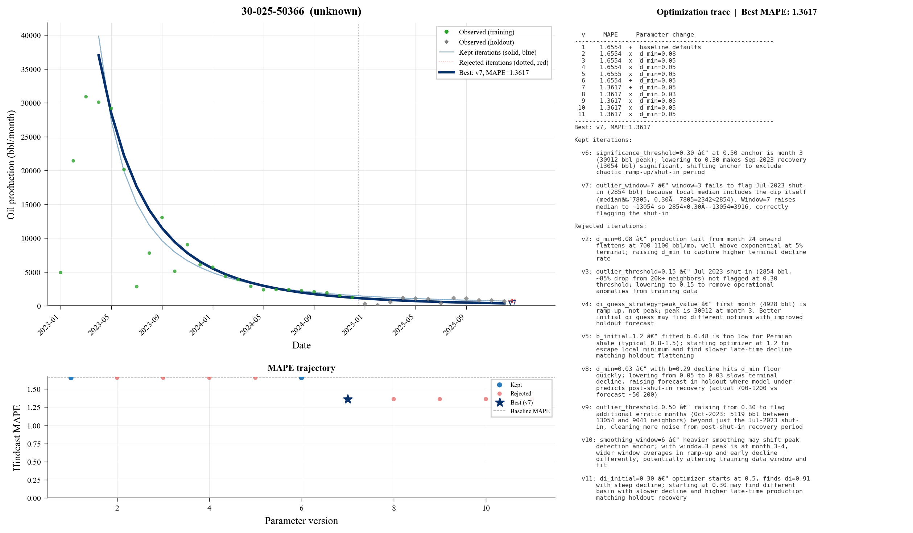
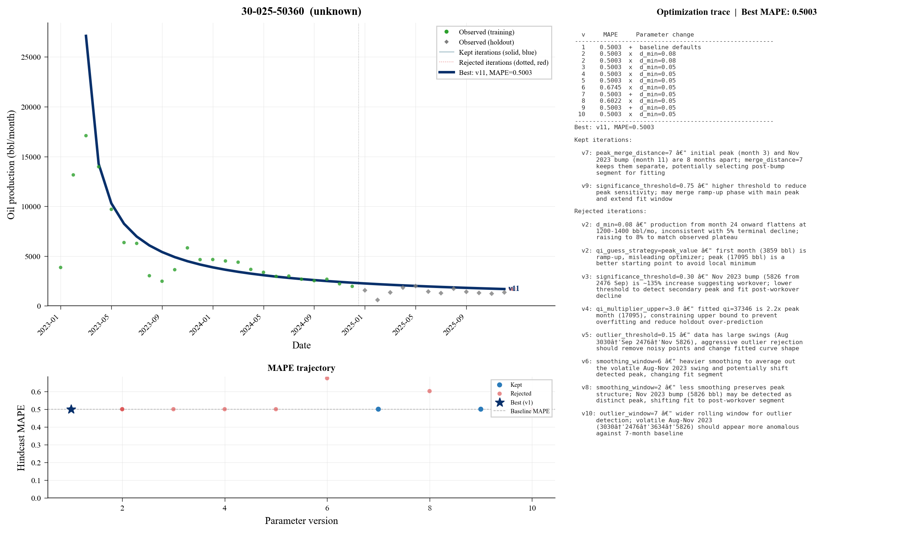
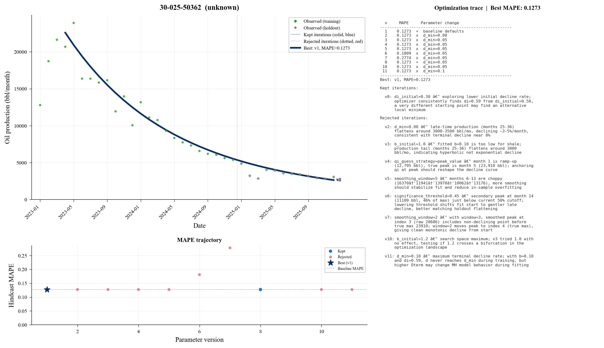
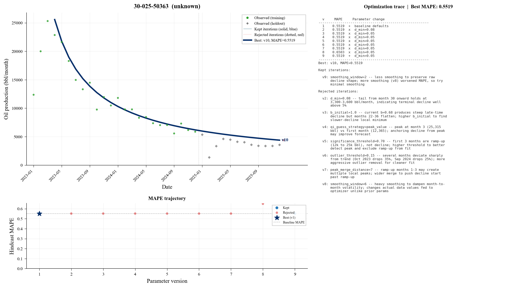
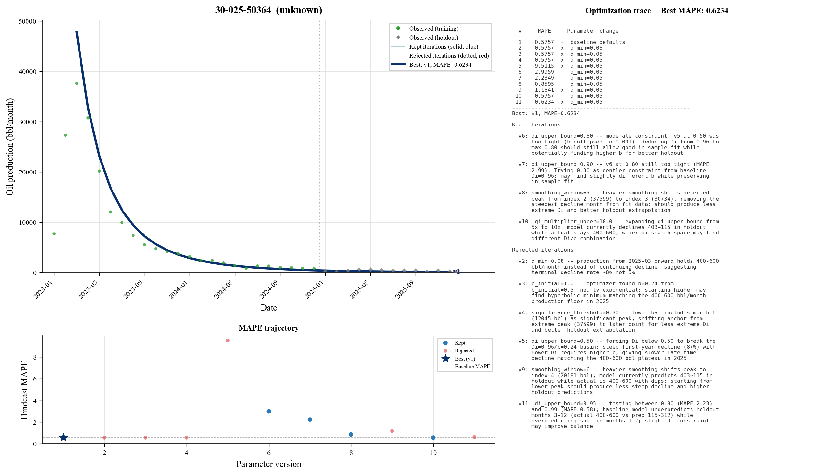

# declineswarm

AI-driven decline curve analysis. Spawns a swarm of Claude Code agents that each optimize [Arps decline parameters](https://petbox-dca.readthedocs.io/) for a single oil well, using hindcast MAPE as the objective function.

Each agent runs an autonomous experiment loop , proposing one parameter change at a time, evaluating it against a 12-month holdout, and committing improvements to git. The result is a per-well parameter set tuned to that well's production signature.



## How it works

```
┌─────────────┐
│  run_swarm   │  Reset atoms to baseline, spawn N parallel agents
└──────┬──────┘
       │
       ▼
┌─────────────┐     ┌──────────────┐     ┌─────────────────┐
│  program.md  │────▶│  run_eval.py  │────▶│  trace.jsonl     │
│  (agent loop)│     │  (fit + score │     │  hindcast.json   │
└─────────────┘     │  + auto-log)  │     │  fit.json        │
       │            └──────────────┘     └─────────────────┘
       ▼
  params.json
  (keep or revert)
```

Each swarm run starts from a **blank slate** , `run_swarm.py` resets every atom to baseline (version 1) before launching agents. This means every run produces a complete, reproducible optimization trace from scratch.

### The agent loop

1. Evaluate baseline parameters (version 1) to establish starting MAPE
2. Read `trace.jsonl` to see what has been tried
3. Propose ONE parameter change with a specific hypothesis
4. Run `python run_eval.py` , this automatically logs results to `trace.jsonl` and `hindcast.json`
5. If MAPE improved → `git commit`. If not → revert `params.json` only (trace is preserved)
6. Repeat until convergence or max turns

### Pipeline components

| File | Role |
|------|------|
| `setup.py` | Pull 50 stratified TX wells (highrate, shale, stripper, conventional) from DuckDB |
| `setup_nm.py` | Pull NM wells with first production in 2023 (configurable count) |
| `run_swarm.py` | Reset atoms to baseline, launch parallel Claude Code agents |
| `program.md` | Agent prompt template , the experiment loop instructions |
| `run_eval.py` | Fit Arps decline on training data, forecast 12-month holdout, compute MAPE, auto-log to trace |
| `read_results.py` | Portfolio-level summary across all wells |
| `plot_wells.py` | Journal-ready per-well hindcast figures with optimization traces |

## Project structure

```
declineswarm/
├── arps.py            # Arps decline models via petbox-dca (exp/hyp/harmonic)
├── preprocessing.py   # Peak detection + outlier filtering
├── evaluation.py      # Fit-and-score pipeline
├── run_eval.py        # Hindcast evaluator + automated trace logging
├── run_swarm.py       # Parallel agent orchestrator + blank-slate reset
├── read_results.py    # Portfolio summary
├── plot_wells.py      # Per-well hindcast visualization
├── setup.py           # TX well selection + atom creation
├── setup_nm.py        # NM well selection + atom creation
├── program.md         # Agent prompt template
├── docs/              # Example plots
└── wells/
    ├── TX/            # Texas wells (stratified by type)
    │   └── {api}/
    └── NM/            # New Mexico wells (2023 vintage)
        └── {api}/
            ├── production.csv   # Monthly oil/gas/water (immutable)
            ├── params.json      # Current parameters (overwritten each version)
            ├── fit.json         # Latest fit result (overwritten each eval)
            ├── hindcast.json    # Scoring history (appended each eval)
            └── trace.jsonl      # Full experiment log (appended each eval)
```

## The atom

Every well is a self-contained directory , an "atom". An agent working on well `30-025-50362` touches nothing outside `wells/NM/30-025-50362/`. This isolation guarantee makes the swarm safe to run in parallel.

### File lifecycle

| File | Written by | Behavior | Purpose |
|------|-----------|----------|---------|
| `production.csv` | `setup.py` / `setup_nm.py` | Immutable | Raw monthly production history |
| `params.json` | Agent | **Overwritten** each version | Current tuning parameters + description |
| `fit.json` | `run_eval.py` | **Overwritten** each eval | Latest fit (qi, di, b, d_min, R², MAPE) |
| `hindcast.json` | `run_eval.py` | **Appended** each eval | Version-by-version MAPE and R² history |
| `trace.jsonl` | `run_eval.py` | **Appended** each eval | Full experiment log with fit details and reasoning |

On each swarm run, `run_swarm.py` resets `params.json` to version 1 baseline, clears `trace.jsonl` and `hindcast.json`, and deletes `fit.json`. The agent then builds the full history from scratch.

## Visualization

`plot_wells.py` generates one figure per well with three panels:

| Panel | Content |
|-------|---------|
| **Top left** | Production scatter + decline curve overlays for every version |
| **Bottom left** | MAPE trajectory across versions (green = kept, red = rejected) |
| **Right** | Full optimization trace , parameter changes, reasoning, and outcomes |

### Reading the plots

- **Green dots** , observed production (training period)
- **Grey dashed** , observed production (12-month holdout)
- **Blue lines** (light → dark) , kept iterations, showing how the fit evolved
- **Red dotted** , rejected iterations
- **Dark navy bold** , best/final version
- **Right panel** , complete optimization trace with agent reasoning

<p align="center">
  
  
</p>
<p align="center">
  
  
</p>

```bash
python plot_wells.py TX                           # all TX wells
python plot_wells.py NM 30-025-50075              # single NM well
```

## Tunable parameters

Each well's `params.json` controls two stages:

**Preprocessing** , how production history is prepared before fitting:
- `significance_threshold` , peak detection sensitivity (0.30–0.75)
- `smoothing_window` , moving average width for peak finding (2–6)
- `outlier_window` / `outlier_threshold` , rolling median outlier filter
- `peak_merge_distance` , merge nearby peaks within N months (2–8)

**Fitting** , Arps curve fit controls:
- `d_min` , terminal decline rate floor (0.03–0.10, most impactful parameter)
- `di_initial` / `b_initial` , optimizer starting guesses
- `qi_guess_strategy` , how initial rate is estimated (`first`, `max3`, `peak_value`)
- `qi_multiplier_upper` , upper bound on qi as multiple of guess (3–10)
- `di_upper_bound` / `b_upper_bound` , optimizer bounds

## Quick start

```bash
# Install dependencies
pip install petbox-dca scipy numpy duckdb matplotlib

# Set up well atoms (requires a DuckDB warehouse)
python setup.py                    # TX wells (stratified)
python setup_nm.py                 # NM wells (2023 vintage, top 50)
python setup_nm.py --count 100     # or specify count
python setup_nm.py --all           # all eligible NM wells

# Run the swarm (requires Claude Code CLI)
# NOTE: --iterations is LLM turns, not experiments.
# Each experiment costs ~4-5 turns, so 50 turns ≈ 10 experiments.
python run_swarm.py NM --max-workers 5
python run_swarm.py TX --max-workers 4 --iterations 100

# Run a subset
python run_swarm.py NM --wells 30-025-50360 30-025-50366 --iterations 50

# View results
python read_results.py             # all states
python read_results.py TX          # one state

# Generate plots
python plot_wells.py TX
python plot_wells.py NM
```

## Inspiration

Inspired by Andrej Karpathy's [autoresearch](https://github.com/karpathy/autoresearch).

Both projects exploit the same core insight: **an LLM can search complex parameter spaces that defeat traditional optimization.** Any real-world objective surface , whether it's GPT validation loss or oil well hindcast error , is riddled with local minima, saddle points, and heuristic traps. Grid search and Bayesian optimization can navigate these surfaces, but they're blind: they see numbers, not reasons.

The LLM changes the game by producing a **reasoning trace between each step**. It reads the history of what's been tried, forms a hypothesis about why the last knob-turn helped or hurt, and chooses the next experiment accordingly. Each iteration is a closed loop: propose a change, evaluate against a single objective function, interpret the result in context, keep or revert. The trace of reasoning is the real differentiator , it's what lets the agent avoid revisiting dead ends, distinguish structural constraints from preprocessing artifacts, and build intuition about the shape of the surface as it searches.

This is the abstraction both projects share: **the LLM as a guided search agent over non-convex objective surfaces, with interpretable reasoning at every step.**

| Concept | autoresearch | declineswarm |
|---------|-------------|--------------|
| **Domain** | LLM training (GPT) | Oil & gas decline curve analysis |
| **Objective surface** | Validation bits-per-byte over architecture/hyperparameter space | 12-month hindcast MAPE over preprocessing + Arps parameter space |
| **What the agent edits** | `train.py` (model architecture, hyperparameters) | `params.json` (preprocessing + Arps fit parameters) |
| **Evaluation** | 5-minute training run | `run_eval.py` fit + forecast |
| **Reasoning trace** | Agent notes in commit messages | `trace.jsonl` with per-step hypothesis and outcome |
| **Instructions** | `program.md` (research directions) | `program.md` (experiment loop template) |
| **Parallelism** | Single GPU, one experiment at a time | One agent per well, N wells in parallel |

Where autoresearch explores architecture space with depth on a single model, declineswarm explores parameter space with breadth across a portfolio of wells.

## Requirements

- Python 3.10+
- [Claude Code CLI](https://docs.anthropic.com/en/docs/claude-code)
- [petbox-dca](https://pypi.org/project/petbox-dca/)
- scipy, numpy, matplotlib
- duckdb (for setup scripts only)

## License

MIT
