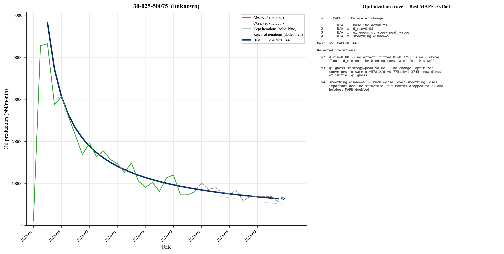

# declineswarm

AI-driven decline curve analysis. Spawns a swarm of Claude Code agents that each optimize [Arps decline parameters](https://petbox-dca.readthedocs.io/) for a single oil well, using hindcast MAPE as the objective function.

Each agent runs an autonomous experiment loop, proposing one parameter change at a time, evaluating it against a 12-month holdout, and committing improvements to git. The result is a per-well parameter set tuned to that well's production signature.

## How it works

```
┌─────────────┐
│  run_swarm   │  Spawns N parallel Claude Code agents
└──────┬──────┘
       │
       ▼
┌─────────────┐     ┌──────────────┐     ┌─────────────┐
│  program.md  │────▶│  run_eval.py  │────▶│  hindcast    │
│  (agent loop)│     │  (scoring)    │     │  MAPE / R²   │
└─────────────┘     └──────────────┘     └─────────────┘
       │                    │
       ▼                    ▼
  params.json          fit.json
  trace.jsonl          hindcast.json
```

1. **`setup.py`** -- Pulls 50 stratified TX wells (highrate, shale, stripper, conventional) from a DuckDB warehouse
2. **`setup_nm.py`** -- Pulls NM wells with first production in 2023 (configurable count)
3. **`run_swarm.py`** -- Launches parallel Claude Code agents, one per well
4. **`program.md`** -- The agent prompt: read params, propose a change, run eval, commit if improved
5. **`run_eval.py`** -- Fits Arps decline on training data (all months minus last 12), forecasts the holdout period, computes MAPE
6. **`read_results.py`** -- Portfolio-level summary across all wells
7. **`plot_wells.py`** -- Generates journal-ready per-well hindcast figures with optimization traces

## Project structure

```
declineswarm/
├── arps.py            # Arps decline models via petbox-dca (exp/hyp/harmonic)
├── preprocessing.py   # Peak detection + outlier filtering
├── evaluation.py      # Fit-and-score pipeline
├── run_eval.py        # Hindcast evaluator (train/holdout split)
├── run_swarm.py       # Parallel agent orchestrator
├── read_results.py    # Portfolio summary
├── plot_wells.py      # Per-well hindcast visualization
├── setup.py           # TX well selection + atom creation
├── setup_nm.py        # NM well selection + atom creation
├── program.md         # Agent prompt template
└── wells/
    ├── TX/            # Texas wells (stratified by type)
    │   └── {api}/
    └── NM/            # New Mexico wells (2023 vintage)
        └── {api}/
            ├── production.csv   # Monthly oil/gas/water history
            ├── params.json      # Current tuning parameters (versioned)
            ├── fit.json         # Best fit result
            ├── hindcast.json    # Scoring history across versions
            └── trace.jsonl      # Agent reasoning log
```

## Visualization



`plot_wells.py` generates one figure per well showing:

- **Green line** -- observed production (training period)
- **Grey dashed** -- observed production (12-month holdout)
- **Blue lines** (light to dark) -- kept iterations, showing how the fit evolved
- **Red dotted** -- rejected iterations
- **Dark navy bold** -- best/final version, always the most prominent curve
- **Right panel** -- full optimization trace with parameter changes and reasoning

```bash
python plot_wells.py TX                           # all TX wells
python plot_wells.py NM 30-025-50075              # single NM well
```

## Tunable parameters

Each well's `params.json` controls two stages:

**Preprocessing** -- how production history is prepared before fitting:
- `significance_threshold` -- peak detection sensitivity (0.30-0.75)
- `smoothing_window` -- moving average width for peak finding
- `outlier_window` / `outlier_threshold` -- rolling median outlier filter

**Fitting** -- Arps curve fit controls:
- `d_min` -- terminal decline rate (most impactful parameter)
- `di_initial` / `b_initial` -- optimizer starting guesses
- `qi_guess_strategy` -- how initial rate is estimated (`first`, `max3`, `peak_value`)

## Quick start

```bash
# Install dependencies
pip install petbox-dca scipy numpy duckdb matplotlib

# Set up well atoms (requires a DuckDB warehouse)
python setup.py                    # TX wells (stratified)
python setup_nm.py                 # NM wells (2023 vintage, top 50)
python setup_nm.py --count 100     # or specify count
python setup_nm.py --all           # all eligible NM wells

# Run the swarm (requires Claude Code CLI)
python run_swarm.py TX --max-workers 4
python run_swarm.py NM --max-workers 8

# Run a subset
python run_swarm.py TX --wells 42-001-32769 42-003-37265 --iterations 20

# View results
python read_results.py             # all states
python read_results.py TX          # one state

# Generate plots
python plot_wells.py TX
python plot_wells.py NM
```

## Requirements

- Python 3.10+
- [Claude Code CLI](https://docs.anthropic.com/en/docs/claude-code)
- [petbox-dca](https://pypi.org/project/petbox-dca/)
- scipy, numpy, matplotlib
- duckdb (for setup scripts only)

## License

MIT
